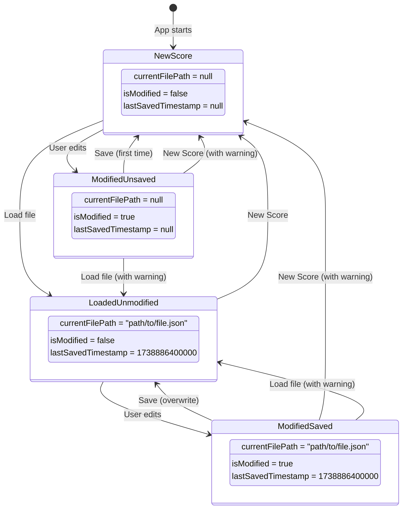
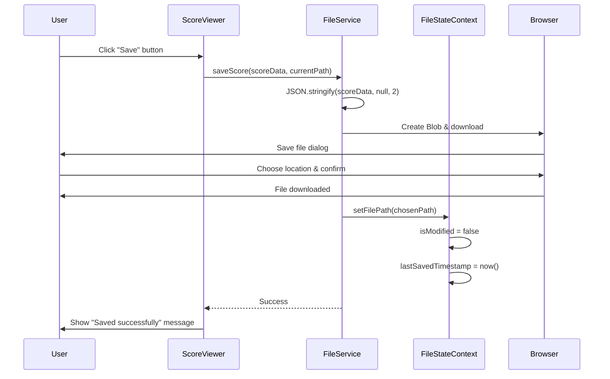
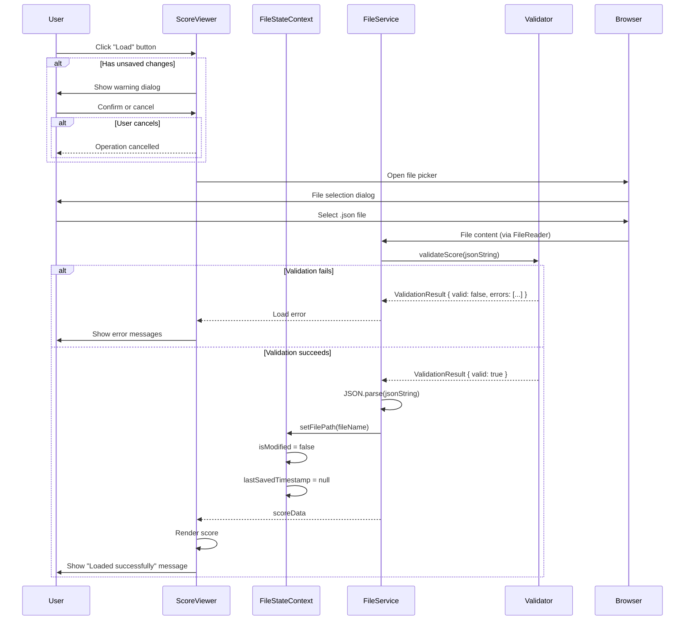
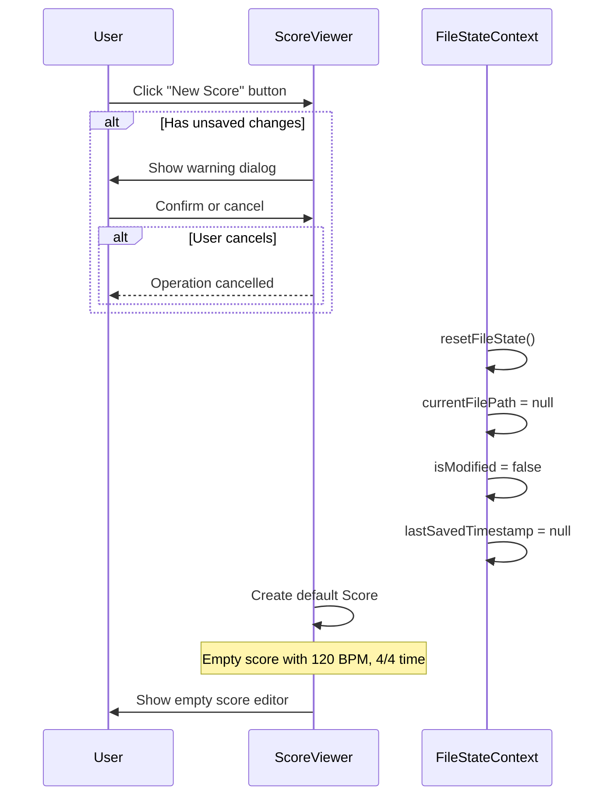

# Data Model: Score File Persistence

**Date**: 2026-02-07  
**Feature**: [spec.md](./spec.md) | **Plan**: [plan.md](./plan.md)  
**Phase**: Phase 1 - Design

## Overview

This feature introduces **no new domain entities** in the backend. It adds a frontend-only state entity (`FileState`) to track file operations. The Score domain model remains unchanged and is directly serialized to JSON.

---

## Entity: FileState (Frontend Only)

**Purpose**: Track the current file path and modification status for unsaved changes warnings.

**Lifecycle**: Created when app loads, updated on save/load/edit operations, persisted in React Context.

### Attributes

| Attribute | Type | Constraints | Description |
|-----------|------|-------------|-------------|
| `currentFilePath` | `string \| null` | Max 260 chars (Windows path limit) | Absolute path or filename of currently loaded file. `null` = unsaved new score. |
| `isModified` | `boolean` | Required | `true` if score has unsaved changes since last save/load. `false` otherwise. |
| `lastSavedTimestamp` | `number \| null` | Unix timestamp (ms) | Timestamp of last successful save. `null` if never saved. Used for future conflict detection. |

### State Transitions



### Operations

#### `setFilePath(path: string | null)`
**Preconditions**: Valid file path or null  
**Postconditions**: `currentFilePath` updated, `isModified` set to false, `lastSavedTimestamp` set to current time  
**Triggers**: After successful save or load operation

#### `setModified(modified: boolean)`
**Preconditions**: None  
**Postconditions**: `isModified` updated  
**Triggers**: Any score edit (note added, tempo changed, etc.) sets `true`; successful save sets `false`

#### `resetFileState()`
**Preconditions**: User confirms unsaved changes warning (if applicable)  
**Postconditions**: All fields reset to initial state (null, false, null)  
**Triggers**: "New Score" action

---

## Entity: Score (Backend Domain - No Changes)

**Purpose**: Aggregate root containing all musical elements. Already serialized via REST API.

**Format**: The Score entity is serialized to JSON using the existing Rust `#[derive(Serialize)]` implementation. No format changes needed.

### JSON Structure (as returned by GET /api/v1/scores/:id)

See [contracts/score-file.json](./contracts/score-file.json) for complete example.

**Key Fields**:
- `id` (string): UUID of the score
- `name` (string): Human-readable score title
- `global_structural_events` (array): Tempo and time signature events
- `instruments` (array): Instrument definitions with staves, voices, and notes

**Data Fidelity**: All fields preserved exactly as stored in backend. No transformations or omissions.

---

## Validation Rules

### JSON File Validation (Frontend)

**Layer 1: Syntax**
- File must be valid JSON
- Error: "Invalid JSON file format: [parse error message]"

**Layer 2: Structure**
- Required fields: `id`, `global_structural_events`, `instruments`
- Field types:
  - `id`: string (UUID format)
  - `global_structural_events`: array
  - `instruments`: array
- Error: "Missing required field: [field name]" or "Invalid type for [field]: expected [type], got [type]"

**Layer 3: Domain Rules**
- MIDI pitch values: 21-108 (A0 to C8)
- Tick values: non-negative integers (0+)
- Duration values: positive integers (1+)
- BPM values: 20-300 (reasonable tempo range)
- Time signature numerator: 1-32
- Time signature denominator: 1, 2, 4, 8, 16, 32 (powers of 2)
- Error: "Invalid [field] value '[value]': [specific constraint]"

**Validation Result**:
```typescript
interface ValidationResult {
  valid: boolean;
  errors: string[];  // Empty if valid, detailed messages if invalid
}
```

---

## Type Definitions (TypeScript)

### FileState Interface
```typescript
interface FileState {
  currentFilePath: string | null;
  isModified: boolean;
  lastSavedTimestamp: number | null;
}
```

### ValidationError Interface
```typescript
interface ValidationError {
  field: string;       // e.g., "instruments[0].staves[0].voices[0].notes[2].pitch"
  message: string;     // e.g., "MIDI pitch 200 out of range (21-108)"
  severity: 'error' | 'warning';
}
```

### Score Type (Existing - No Changes)
Already defined in `frontend/src/types/score.ts` (mirrors backend Rust types via API contract).

---

## Data Flow Diagrams

### Save Score Flow


### Load Score Flow


### New Score Flow


---

## Relationships

### FileState → Score
- **Relationship**: References (1:1)
- **Nature**: FileState tracks metadata *about* the Score file, not the Score itself
- **Cardinality**: Each FileState references exactly one Score (the currently loaded/edited one)
- **Lifecycle**: FileState exists independently; Score data comes from backend or file

### Score → Instruments → Staves → Voices → Notes
- **Relationship**: Composition (1:many at each level)
- **Nature**: Existing backend domain model; no changes for this feature
- **Serialization**: Entire tree serialized to JSON with no transformations

---

## Performance Considerations

### Serialization Performance
- **Target**: SC-002: Save operation <1s for 100 measures, 10 instruments
- **Approach**: Native `JSON.stringify()` is highly optimized in modern JS engines
- **Expected**: Typical score (~50 measures, 5 instruments) serializes in ~10-50ms
- **Worst case**: 100 measures, 10 instruments ~100-200ms (well under 1s target)

### Deserialization Performance
- **Target**: SC-003: Load operation <2s for 100 measures, 10 instruments
- **Breakdown**:
  - JSON.parse(): ~50-100ms
  - Validation: ~50-100ms
  - State update + re-render: ~100-200ms
  - Total: ~200-400ms (well under 2s target)

### File Size
- **Target**: SC-004: <1MB for typical scores (50 measures, 5 instruments)
- **Typical**: ~200-300 KB (pretty-printed JSON with 2-space indent)
- **Large**: 100 measures, 10 instruments ~500-700 KB (still under 1MB)

---

## Data Model Completion Checklist

- [x] FileState entity defined with attributes and operations
- [x] Score serialization format documented (no changes to backend)
- [x] Validation rules specified for all layers
- [x] Type definitions provided for TypeScript implementation
- [x] Data flow diagrams created (save, load, new)
- [x] Relationships documented
- [x] Performance targets mapped to success criteria
- [x] No new backend entities required

**Status**: ✅ Data model complete. Ready for contract definition.
