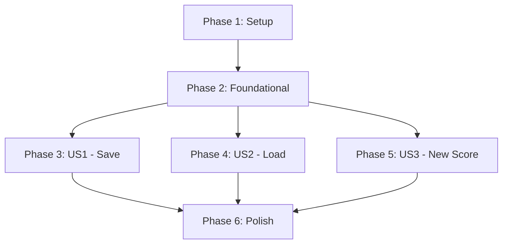

# Tasks: Score File Persistence

**Feature Branch**: `004-save-load-scores`  
**Input**: Design documents from `/specs/004-save-load-scores/`  
**Prerequisites**: [plan.md](./plan.md), [spec.md](./spec.md), [research.md](./research.md), [data-model.md](./data-model.md), [contracts/](./contracts/)

**Organization**: Tasks are grouped by user story to enable independent implementation and testing of each story.

## Format: `[ID] [P?] [Story] Description`

- **[P]**: Can run in parallel (different files, no dependencies)
- **[US#]**: Which user story this task belongs to (US1, US2, US3)
- All file paths are absolute from repository root

---

## Phase 1: Setup (Foundational Infrastructure)

**Purpose**: Create directory structure and type definitions that all user stories depend on

- [X] T001 [P] Create file service directory structure in frontend/src/services/file/
- [X] T002 [P] Create state service directory structure in frontend/src/services/state/
- [X] T003 [P] Create type definitions file in frontend/src/types/file.ts with FileState, ValidationError, ValidationResult interfaces
- [X] T004 [P] Create integration test directory in frontend/tests/integration/

**Checkpoint**: Directory structure ready - foundational types defined

---

## Phase 2: Foundational (Core Components - BLOCKS All User Stories)

**Purpose**: Core validation and state management infrastructure that MUST be complete before ANY user story

**⚠️ CRITICAL**: No user story work can begin until this phase is complete

### Tests (TDD - Write First, Ensure FAIL)

- [X] T005 [P] Write validation tests in frontend/src/services/file/validation.test.ts (syntax, structure, domain validation)
- [X] T006 [P] Write FileStateContext tests in frontend/src/services/state/FileStateContext.test.tsx (state updates, transitions)

### Implementation

- [X] T007 Implement JSON validation layers in frontend/src/services/file/validation.ts (validateScoreFile function with 3-layer validation)
- [X] T008 Implement FileStateContext in frontend/src/services/state/FileStateContext.tsx (React Context with setFilePath, setModified, resetFileState actions)

**Checkpoint**: Foundation complete - validation and state management working - user stories can now proceed in parallel

---

## Phase 3: User Story 1 - Save Score to File (Priority: P1) 🎯 MVP

**Goal**: Users can save their score to a JSON file via browser download, preserving all musical data

**Independent Test**: Create a score with instruments and notes, click Save button, verify JSON file downloads with correct structure and data

### Tests for User Story 1 (TDD - Write First, Ensure FAIL)

- [X] T009 [P] [US1] Write FileService save tests in frontend/src/services/file/FileService.test.ts (saveScore creates Blob, triggers download, updates file state)
- [X] T010 [P] [US1] Write integration test for save flow in frontend/tests/integration/file-persistence.test.tsx (full save cycle with UI interaction)

### Implementation for User Story 1

- [X] T011 [US1] Implement saveScore function in frontend/src/services/file/FileService.ts (JSON.stringify with pretty-print, Blob creation, download trigger)
- [X] T012 [US1] Add Save button to ScoreViewer component in frontend/src/components/ScoreViewer.tsx (calls FileService.saveScore, updates FileState)
- [X] T013 [US1] Implement file state update on score edits in frontend/src/components/ScoreViewer.tsx (set isModified=true when notes/tempo/etc. change)
- [X] T014 [US1] Add success notification on save completion in frontend/src/components/ScoreViewer.tsx (toast/alert showing "Score saved successfully")

**Checkpoint**: User Story 1 complete - users can save scores and file persists with 100% fidelity (verify SC-001, SC-002, SC-004, SC-005)

---

## Phase 4: User Story 2 - Load Score from File (Priority: P2)

**Goal**: Users can load previously saved score files via browser file picker, with validation and unsaved changes warnings

**Independent Test**: Click Load button, select valid JSON file, verify score displays correctly with all data preserved

### Tests for User Story 2 (TDD - Write First, Ensure FAIL)

- [X] T015 [P] [US2] Write FileService load tests in frontend/src/services/file/FileService.test.ts (loadScore parses JSON, validates, updates state, handles errors)
- [X] T016 [P] [US2] Write integration test for load flow in frontend/tests/integration/file-persistence.test.tsx (file selection, validation, score rendering)
- [X] T017 [P] [US2] Write integration test for unsaved changes warning in frontend/tests/integration/file-persistence.test.tsx (warning displays, cancel preserves work, continue loads file)

### Implementation for User Story 2

- [X] T018 [US2] Implement loadScore function in frontend/src/services/file/FileService.ts (FileReader API, JSON.parse, validation call, state update)
- [X] T019 [US2] Add Load button with file input to ScoreViewer component in frontend/src/components/ScoreViewer.tsx (file picker dialog, calls FileService.loadScore)
- [X] T020 [US2] Implement unsaved changes warning dialog in frontend/src/components/ScoreViewer.tsx (checks isModified, shows confirmation before load)
- [X] T021 [US2] Add error display for invalid files in frontend/src/components/ScoreViewer.tsx (show validation errors from ValidationResult)
- [X] T022 [US2] Add success notification on load completion in frontend/src/components/ScoreViewer.tsx (toast/alert showing "Score loaded successfully")

**Checkpoint**: User Story 2 complete - users can load scores with validation and warnings (verify SC-001, SC-003, SC-006, SC-007, SC-008)

---

## Phase 5: User Story 3 - New Score Creation (Priority: P3)

**Goal**: Users can create a new empty score, clearing the workspace with unsaved changes protection

**Independent Test**: Click New Score button, confirm if prompted about unsaved changes, verify empty score with default tempo (120 BPM) and time signature (4/4)

### Tests for User Story 3 (TDD - Write First, Ensure FAIL)

- [X] T023 [P] [US3] Write FileService new score tests in frontend/src/services/file/FileService.test.ts (createNewScore resets state, creates default score)
- [X] T024 [P] [US3] Write integration test for new score flow in frontend/tests/integration/file-persistence.test.tsx (button click, warning dialog, empty score creation)

### Implementation for User Story 3

- [X] T025 [US3] Implement createNewScore function in frontend/src/services/file/FileService.ts (calls FileStateContext.resetFileState, returns default Score object)
- [X] T026 [US3] Add New Score button to ScoreViewer component in frontend/src/components/ScoreViewer.tsx (calls FileService.createNewScore)
- [X] T027 [US3] Implement unsaved changes warning dialog for new score in frontend/src/components/ScoreViewer.tsx (checks isModified, shows confirmation before creating new)
- [X] T028 [US3] Update UI to render new empty score in frontend/src/components/ScoreViewer.tsx (clear instruments, reset to default tempo/time signature)

**Checkpoint**: User Story 3 complete - users can create new scores safely (verify SC-008, FR-008)

---

## Phase 6: Polish & Cross-Cutting Concerns

**Purpose**: Integration testing, documentation, and validation across all user stories

- [X] T029 [P] Add comprehensive integration test for full workflow in frontend/tests/integration/file-persistence.test.tsx (create score → save → modify → unsaved warning → load → new)
- [X] T030 [P] Add round-trip fidelity test in frontend/tests/integration/file-persistence.test.tsx (save → load → compare all fields, verify SC-001)
- [X] T031 [P] Add performance tests in frontend/tests/integration/file-persistence.test.tsx (large score save/load timing, verify SC-002, SC-003)
- [X] T032 [P] Update ScoreViewer component with keyboard shortcuts in frontend/src/components/ScoreViewer.tsx (Ctrl+S for save, Ctrl+O for load, Ctrl+N for new)
- [X] T033 [P] Add beforeunload warning in frontend/src/components/ScoreViewer.tsx (warn if isModified=true on browser close/navigate)
- [ ] T034 Run manual test suite from quickstart.md (all 5 test suites, cross-browser validation)
- [X] T035 Update documentation with save/load features in README.md or docs/
- [X] T036 Code cleanup and refactoring across file service and components
- [ ] T037 Performance profiling with large scores (100 measures, 10 instruments)

**Checkpoint**: Feature complete - all user stories integrated, tested, and documented

---

## Dependencies & Execution Order

### Phase Dependencies



- **Setup (Phase 1)**: No dependencies - can start immediately
- **Foundational (Phase 2)**: Depends on Setup completion - BLOCKS all user stories
- **User Stories (Phase 3-5)**: All depend on Foundational phase completion
  - US1, US2, US3 can then proceed in parallel (if team capacity allows)
  - Or sequentially in priority order (P1 → P2 → P3)
- **Polish (Phase 6)**: Depends on all user stories being complete

### User Story Dependencies

- **User Story 1 (P1) - Save**: Can start after Foundational (Phase 2) - No dependencies on other stories
- **User Story 2 (P2) - Load**: Can start after Foundational (Phase 2) - Independent (uses same FileState/validation but different code paths)
- **User Story 3 (P3) - New Score**: Can start after Foundational (Phase 2) - Independent (simple state reset, no file I/O)

### Within Each User Story (TDD Workflow)

1. **Tests FIRST** (T009-T010 for US1, T015-T017 for US2, T023-T024 for US3)
   - Write unit tests → Verify they FAIL
   - Write integration tests → Verify they FAIL
2. **Implementation** (T011-T014 for US1, T018-T022 for US2, T025-T028 for US3)
   - Implement minimal code to pass tests
   - Verify tests now PASS
   - Refactor for quality
3. **Checkpoint** - Story complete and independently testable

### Parallel Opportunities

**Within Phase 1 (Setup)**: All tasks (T001-T004) can run in parallel

**Within Phase 2 (Foundational)**:
- Tests T005, T006 can run in parallel
- Implementation T007, T008 run sequentially after tests fail

**Within User Story 1**:
- Tests T009, T010 can run in parallel (different test files)
- Implementation tasks T011-T014 run sequentially (T011 first, then T012-T014)

**Within User Story 2**:
- Tests T015, T016, T017 can run in parallel
- Implementation tasks T018-T022 run sequentially (T018 first, then T019-T022)

**Within User Story 3**:
- Tests T023, T024 can run in parallel
- Implementation tasks T025-T028 run sequentially (T025 first, then T026-T028)

**Within Phase 6 (Polish)**: Most tasks (T029-T033, T035-T037) can run in parallel except T034 (manual testing)

**Across User Stories**: Once Foundational (Phase 2) is complete, ALL user stories (Phase 3, 4, 5) can be worked on in parallel by different team members

---

## Parallel Example: Foundational Phase

```bash
# All test writing can happen in parallel:
Developer A: "Write validation tests in frontend/src/services/file/validation.test.ts"
Developer B: "Write FileStateContext tests in frontend/src/services/state/FileStateContext.test.tsx"

# Then implementation (after tests fail):
Developer A: "Implement validation.ts"
Developer B: "Implement FileStateContext.tsx"
```

## Parallel Example: User Stories (After Foundation Complete)

```bash
# Three developers can work on three stories simultaneously:
Developer A: Phase 3 - User Story 1 (Save) - T009 through T014
Developer B: Phase 4 - User Story 2 (Load) - T015 through T022
Developer C: Phase 5 - User Story 3 (New Score) - T023 through T028

# Each story is independently testable and deliverable
```

---

## Implementation Strategy

### MVP First (User Story 1 Only - Fastest Value Delivery)

1. Complete **Phase 1: Setup** (T001-T004) → ~30 minutes
2. Complete **Phase 2: Foundational** (T005-T008) → ~2 hours
3. Complete **Phase 3: User Story 1** (T009-T014) → ~3 hours
4. **STOP and VALIDATE**: Test save functionality independently using quickstart.md Test Suite 1
5. **Deploy/Demo**: Users can now save their scores! 🎉

**MVP Milestone**: Users can preserve their work (most critical feature - prevents data loss)

### Incremental Delivery (Each Story Adds Value)

1. **Foundation** (Phases 1-2) → ~2.5 hours → Validation & state management ready
2. **Add US1 - Save** (Phase 3) → ~3 hours → Test independently → **Deploy (MVP!)**
3. **Add US2 - Load** (Phase 4) → ~4 hours → Test independently → **Deploy** (complete persistence workflow)
4. **Add US3 - New Score** (Phase 5) → ~2 hours → Test independently → **Deploy** (full file operations)
5. **Polish** (Phase 6) → ~3 hours → Integration testing, documentation → **Final Release**

**Total Estimated Time**: ~14-15 hours for complete feature (all 3 user stories + polish)

### Parallel Team Strategy (Maximum Speed)

With 3 developers:

1. **Team completes Setup + Foundational together** (Phases 1-2) → ~2.5 hours
2. **Once Foundational is done, split:**
   - Developer A: User Story 1 (Phase 3) → 3 hours
   - Developer B: User Story 2 (Phase 4) → 4 hours
   - Developer C: User Story 3 (Phase 5) → 2 hours
3. **Merge and integrate** → Test all stories together
4. **Team completes Polish together** (Phase 6) → ~3 hours

**Total Parallel Time**: ~9-10 hours (vs 15 hours sequential)

---

## Task Completion Tracking

### Phase 1: Setup (4 tasks)
- [ ] All directory structure created
- [ ] Type definitions in place

### Phase 2: Foundational (4 tasks)
- [ ] Validation system tested and working
- [ ] FileStateContext tested and working

### Phase 3: User Story 1 - Save (6 tasks)
- [ ] Save tests written and passing
- [ ] Save functionality working
- [ ] SC-001, SC-002, SC-004, SC-005 verified

### Phase 4: User Story 2 - Load (8 tasks)
- [ ] Load tests written and passing
- [ ] Load functionality working
- [ ] Unsaved changes warnings working
- [ ] SC-001, SC-003, SC-006, SC-007, SC-008 verified

### Phase 5: User Story 3 - New Score (4 tasks)
- [ ] New score tests written and passing
- [ ] New score functionality working
- [ ] SC-008, FR-008 verified

### Phase 6: Polish (9 tasks)
- [ ] Integration tests complete
- [ ] Manual testing complete (quickstart.md)
- [ ] Documentation updated
- [ ] Performance validated

**Total Tasks**: 37 tasks across 6 phases

---

## Success Criteria Mapping

| Task(s) | Success Criteria | Verification Method |
|---------|-----------------|---------------------|
| T011, T018, T030 | SC-001: 100% data fidelity | Round-trip test in T030 |
| T011, T031 | SC-002: Save <1s | Performance test in T031 |
| T018, T031 | SC-003: Load <2s | Performance test in T031 |
| T011 | SC-004: File size <1MB | Manual verification in T034 |
| T011 | SC-005: Human-readable JSON | Manual verification in T034 |
| T018 | SC-006: Valid files load 100% | Integration test in T016 |
| T018, T021 | SC-007: Helpful error messages | Validation test in T005, T017 |
| T020, T027, T033 | SC-008: Unsaved warnings 100% | Integration tests in T017, T024 |

---

## Notes

- **[P] marker**: Tasks can run in parallel (different files, no blocking dependencies)
- **[US#] marker**: Maps task to specific user story for traceability and independent delivery
- **TDD Required**: Constitution Principle V mandates tests before implementation
- **File paths**: All paths are absolute from repository root (frontend/src/...)
- **Checkpoints**: Stop after each phase to validate story independence
- **Commits**: Commit after each task or logical task group (e.g., all tests for a story)
- **Validation**: Use [quickstart.md](./quickstart.md) for manual testing after implementation

---

**Status**: Ready for implementation. Start with Phase 1 (Setup) → Phase 2 (Foundational) → Phase 3 (US1 MVP).
