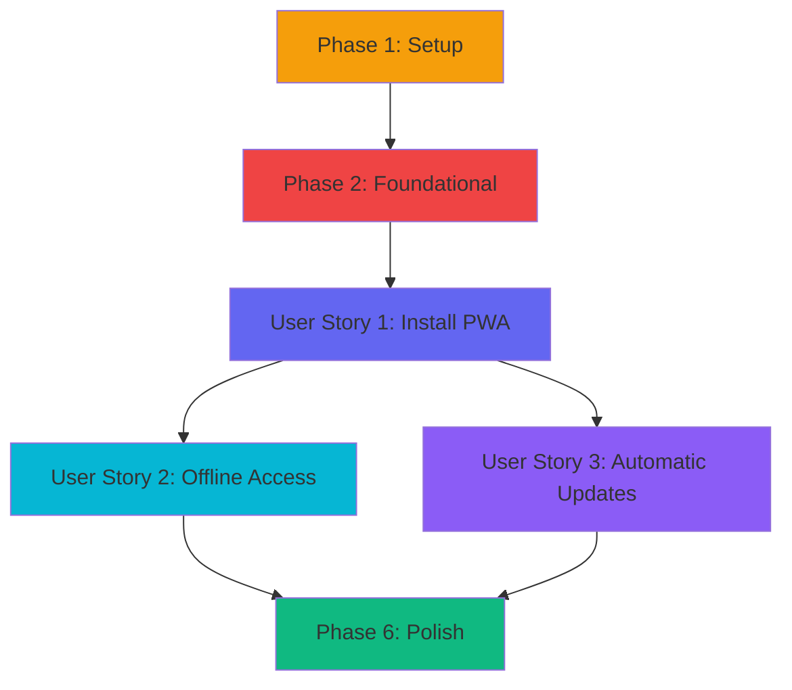

# Tasks: PWA Distribution for Tablets

**Input**: Design documents from `/specs/012-pwa-distribution/`  
**Branch**: `012-pwa-distribution`  
**Prerequisites**: plan.md ✅, spec.md ✅, research.md ✅, data-model.md ✅, contracts/ ✅, quickstart.md ✅

**Tests**: NOT requested in feature specification - focusing on manual testing and Lighthouse audit

**Organization**: Tasks grouped by user story for independent implementation and testing

## Format: `- [ ] [ID] [P?] [Story] Description`

- **[P]**: Can run in parallel (different files, no dependencies)
- **[Story]**: User story label (US1, US2, US3) - only for user story phases
- All paths relative to repository root

---

## Phase 1: Setup (Dependencies & Project Structure)

**Purpose**: Install dependencies and prepare project structure for PWA implementation

- [ ] T001 Navigate to frontend directory and install Workbox libraries (workbox-precaching, workbox-routing, workbox-strategies, workbox-expiration, workbox-window v7.0+)
- [ ] T002 Install vite-plugin-pwa as dev dependency (v0.20+) in frontend/package.json
- [ ] T003 [P] Create frontend/public/icons/ directory for PWA icon assets
- [ ] T004 [P] Create frontend/src/hooks/ directory if it doesn't exist for useServiceWorker hook
- [ ] T005 [P] Verify HTTPS is configured in Vite dev server (vite.config.ts: server.https: true)

**Checkpoint**: Dependencies installed, directory structure ready for PWA files

---

## Phase 2: Foundational (Core PWA Infrastructure)

**Purpose**: Configure Vite PWA plugin and establish base service worker infrastructure that ALL user stories depend on

**⚠️ CRITICAL**: No user story work can begin until this phase is complete

- [ ] T006 Configure vite-plugin-pwa in frontend/vite.config.ts with registerType 'prompt', includeAssets, and manifest metadata (name, short_name, description, theme_color, background_color, display, orientation)
- [ ] T007 Add Workbox runtime caching strategies to vite.config.ts: NetworkFirst for scores (/api/scores/), StaleWhileRevalidate for images, CacheFirst for fonts
- [ ] T008 Set Workbox globPatterns in vite.config.ts to precache all static assets (**/*.{js,css,html,wasm,png,svg,ico})
- [ ] T009 Enable Workbox cleanupOutdatedCaches in vite.config.ts to auto-delete old cache versions
- [ ] T010 Disable vite-plugin-pwa in dev mode (devOptions.enabled: false) to use Vite HMR instead of service worker

**Checkpoint**: Vite PWA plugin configured - service worker will be generated on build

---

## Phase 3: User Story 1 - Install Music Stand App on Tablet (Priority: P1) 🎯 MVP

**Goal**: Enable musicians to install Musicore as a native-like PWA on tablets (iPad, Surface, Android) without app store friction

**Independent Test**: 
1. Deploy to HTTPS staging environment
2. Visit on tablet browser (Safari/Chrome/Edge)
3. Verify install prompt appears (manual on iOS, automatic on Android/Edge)
4. Install app to home screen
5. Launch from home screen icon
6. Verify standalone mode (no browser UI)
7. Confirm Lighthouse PWA audit score ≥90

### Implementation for User Story 1

- [ ] T011 [P] [US1] Create frontend/public/icons/icon-192x192.png (192x192 PNG, any maskable purpose for Android home screen)
- [ ] T012 [P] [US1] Create frontend/public/icons/icon-512x512.png (512x512 PNG, any maskable purpose for Android splash screen)
- [ ] T013 [P] [US1] Create frontend/public/icons/apple-touch-icon.png (180x180 PNG for iOS home screen icon)
- [ ] T014 [P] [US1] Create frontend/public/icons/favicon-32x32.png and favicon-16x16.png for browser favicon
- [ ] T015 [US1] Add iOS PWA meta tags to frontend/src/index.html: apple-mobile-web-app-capable, apple-mobile-web-app-status-bar-style (black-translucent), apple-mobile-web-app-title, theme-color
- [ ] T016 [US1] Add apple-touch-icon link tag and manifest link tag to frontend/src/index.html head section
- [ ] T017 [US1] Verify manifest.webmanifest is generated by vite-plugin-pwa during build (check dist/ directory after npm run build)
- [ ] T018 [P] [US1] Create frontend/src/sw-registration.ts with registerServiceWorker() function using Workbox class from workbox-window
- [ ] T019 [US1] Implement service worker event listeners in sw-registration.ts: 'waiting' (update available), 'controlling' (reload page), 'activated'
- [ ] T020 [US1] Add registerServiceWorker() call to frontend/src/main.tsx with onUpdate, onSuccess, onError callbacks
- [ ] T021 [US1] Add periodic update check in main.tsx: setInterval to call registration.update() every 30 minutes
- [ ] T022 [P] [US1] Create frontend/src/components/IOSInstallModal.tsx component to detect iOS and show manual install instructions (share menu → Add to Home Screen)
- [ ] T023 [P] [US1] Create frontend/src/components/IOSInstallModal.css with modal backdrop, content, and instruction list styles
- [ ] T024 [US1] Add IOSInstallModal component to frontend/src/App.tsx (renders when iOS detected and not in standalone mode)
- [ ] T025 [US1] Implement iOS detection logic in IOSInstallModal.tsx using navigator.platform and window.matchMedia('(display-mode: standalone)')
- [ ] T026 [US1] Add localStorage check in IOSInstallModal.tsx to avoid showing modal repeatedly if user dismisses it

### Manual Testing for User Story 1

- [ ] T027 [US1] Deploy to HTTPS staging environment and test PWA install on physical iPad (iOS 15+/Safari 15+)
- [ ] T028 [US1] Test PWA install on physical Android tablet (Chrome 90+)
- [ ] T029 [US1] Test PWA install on Surface Pro (Edge 90+)
- [ ] T030 [US1] Verify standalone mode launches correctly on all three platforms (no browser chrome visible)
- [ ] T031 [US1] Run Lighthouse PWA audit on staging and verify score ≥90 (installability, service worker, manifest, HTTPS, responsive)

**Checkpoint**: User Story 1 complete - PWA is installable on tablets with proper manifest, icons, and standalone mode. Lighthouse score ≥90.

---

## Phase 4: User Story 2 - Access Scores Offline During Practice (Priority: P2)

**Goal**: Enable musicians to use all practice features (score display, annotations, playback, metronome) without internet connectivity

**Independent Test**:
1. Load app while online and open several scores
2. Enable airplane mode on tablet
3. Close and reopen PWA from home screen
4. Verify app shell loads from cache (<1 second)
5. Open previously loaded scores - verify full notation display
6. Add annotations (fingerings, markings) - verify persistence to IndexedDB
7. Use playback/metronome features - verify WASM engine cached and functional
8. Disable airplane mode (go online)
9. Verify offline annotations sync to backend

### Implementation for User Story 2

- [ ] T032 [P] [US2] Verify Workbox cache-first strategy precaches WASM module (musiccore_backend_bg.wasm) and JS bindings in sw.js (auto-generated by vite-plugin-pwa)
- [ ] T033 [P] [US2] Create frontend/src/services/sw-cache.ts with getCacheSize(), getCacheQuota(), getCacheUsagePercentage() functions using navigator.storage.estimate()
- [ ] T034 [P] [US2] Add clearCache(includeAppShell) function to sw-cache.ts to delete all Musicore caches except optionally app shell
- [ ] T035 [US2] Integrate existing frontend/src/components/OfflineBanner.tsx (from Feature 011) to show when navigator.onLine is false
- [ ] T036 [US2] Test OfflineBanner appears when device goes offline and disappears when connectivity returns
- [ ] T037 [P] [US2] Create frontend/src/services/offline-sync-queue.ts with queueMutation() function to store mutations in IndexedDB with pendingSync: true field
- [ ] T038 [P] [US2] Add syncPendingMutations() function to offline-sync-queue.ts that iterates IndexedDB entries with pendingSync: true and POSTs to backend
- [ ] T039 [US2] Add online event listener to offline-sync-queue.ts: window.addEventListener('online', syncPendingMutations)
- [ ] T040 [US2] Implement last-write-wins conflict resolution in syncPendingMutations() by comparing timestamps
- [ ] T041 [US2] Integrate queueMutation() into annotation save logic (wherever annotations are persisted to IndexedDB from Feature 011)
- [ ] T042 [US2] Add cache usage notification: when cache reaches 80% of quota, show toast message warning about automatic LRU eviction
- [ ] T043 [US2] Verify Workbox ExpirationPlugin is configured with maxEntries: 50 and purgeOnQuotaError: true for scores cache in vite.config.ts

### Manual Testing for User Story 2

- [ ] T044 [US2] Test offline mode on physical iPad: load scores online, enable airplane mode, verify app loads and scores display correctly
- [ ] T045 [US2] Test offline annotations on Android tablet: add fingerings while offline, go online, verify sync to backend
- [ ] T046 [US2] Test WASM engine offline on Surface: use playback/metronome features in airplane mode, verify functionality
- [ ] T047 [US2] Test cache eviction: load 60+ scores (exceed maxEntries: 50), verify oldest scores evicted automatically (LRU)
- [ ] T048 [US2] Measure cached app shell load time on tablet (should be <1 second per SC-003)

**Checkpoint**: User Story 2 complete - 100% of practice features work offline. WASM module cached. Annotations sync when online. Cache managed with LRU eviction.

---

## Phase 5: User Story 3 - Receive Automatic App Updates (Priority: P3)

**Goal**: Enable seamless PWA updates via service worker without app store friction or manual reinstallation

**Independent Test**:
1. Deploy version 1.0 of PWA to staging
2. Install on tablet and open app
3. Deploy version 1.1 with visible change (e.g., new button)
4. Reopen PWA or wait for periodic check (30 min interval)
5. Verify UpdatePrompt notification appears
6. Click "Update Now" button
7. Verify app reloads and new version is active (<5 seconds)
8. Verify all cached data preserved after update

### Implementation for User Story 3

- [ ] T049 [P] [US3] Create frontend/src/hooks/useServiceWorker.ts hook that returns [UpdateState, applyUpdate] using Workbox class from workbox-window
- [ ] T050 [P] [US3] Implement UpdateState interface in useServiceWorker.ts: updateAvailable (boolean), registration (ServiceWorkerRegistration | null)
- [ ] T051 [US3] Add Workbox 'waiting' event listener in useServiceWorker.ts hook to detect when new service worker is waiting
- [ ] T052 [US3] Implement applyUpdate() function in useServiceWorker.ts that calls skipWaiting(registration) helper
- [ ] T053 [P] [US3] Create skipWaiting() helper function in sw-registration.ts: postMessage({type: 'SKIP_WAITING'}) to waiting worker, listen for controllerchange, reload page
- [ ] T054 [P] [US3] Create frontend/src/components/UpdatePrompt.tsx component with updateAvailable prop and onUpdate/onDismiss callbacks
- [ ] T055 [P] [US3] Create frontend/src/components/UpdatePrompt.css with fixed position banner at bottom, primary/secondary button styles
- [ ] T056 [US3] Add UpdatePrompt component to frontend/src/App.tsx using useServiceWorker hook
- [ ] T057 [US3] Implement "Update Now" button in UpdatePrompt.tsx that calls applyUpdate() from useServiceWorker hook
- [ ] T058 [US3] Implement "Later" button in UpdatePrompt.tsx that dismisses banner (update applies on next app launch)
- [ ] T059 [US3] Add service worker message handler in generated sw.js to listen for SKIP_WAITING message and call self.skipWaiting() (verify vite-plugin-pwa generates this)
- [ ] T060 [US3] Verify service worker calls clients.claim() during activate event in generated sw.js (auto-generated by Workbox)

### Manual Testing for User Story 3

- [ ] T061 [US3] Test update detection: deploy v1.0, install on iPad, deploy v1.1, verify UpdatePrompt appears within 30 seconds
- [ ] T062 [US3] Test "Update Now" flow: click button, measure time from click to new version active (should be <5 seconds per SC-006)
- [ ] T063 [US3] Test "Later" flow: dismiss banner, close app, reopen, verify new version activates automatically
- [ ] T064 [US3] Test update during practice session: deploy update while user actively viewing score, verify UpdatePrompt does not force interrupt
- [ ] T065 [US3] Verify cached data preserved: add annotations in v1.0, update to v1.1, verify annotations still present

**Checkpoint**: User Story 3 complete - Update cycle <5 seconds. User-controlled update prompt. No interruption during practice. Data preserved across updates.

---

## Phase 6: Polish & Cross-Cutting Concerns

**Purpose**: CI integration, documentation, performance optimization, and final validation

- [ ] T066 [P] Add Lighthouse PWA audit to CI pipeline: install @lhci/cli, configure lighthouserc.json with PWA category, assert score ≥90
- [ ] T067 [P] Create frontend/tests/service-worker.test.ts with Vitest unit tests for caching strategies (cache-first, network-first, SWR)
- [ ] T068 [P] Add service worker registration test in service-worker.test.ts: verify registerServiceWorker() returns valid registration
- [ ] T069 [P] Add update detection test in service-worker.test.ts: mock Workbox 'waiting' event, verify UpdateState updates correctly
- [ ] T070 Document PWA installation instructions in README.md for iOS (manual share menu), Android (install prompt), Edge (install button)
- [ ] T071 Add PWA troubleshooting section to README.md: HTTPS requirement, cache quota errors, iOS limitations
- [ ] T072 Verify all 18 functional requirements from spec.md are implemented (FR-001 to FR-018)
- [ ] T073 Run final Lighthouse PWA audit on production: verify score ≥90, installability passes, manifest valid, service worker active
- [ ] T074 Measure and document performance metrics: app shell load time (<1s cached), install flow taps (<3), update cycle time (<5s)

**Checkpoint**: Feature 012 complete - All user stories delivered, CI integrated, documentation updated, performance validated

---

## Implementation Strategy

### MVP First (Recommended)

**Week 1**: Phase 1-3 (Setup + Foundational + User Story 1)
- Deliverable: Installable PWA on tablets with Lighthouse score ≥90
- Value: Musicians can install app, basic offline capability via precached app shell

**Week 2**: Phase 4 (User Story 2)
- Deliverable: Full offline functionality with annotation sync
- Value: Musicians can practice without WiFi, all features work offline

**Week 3**: Phase 5 (User Story 3)
- Deliverable: Automatic updates with user control
- Value: Seamless updates without app store friction

**Week 4**: Phase 6 (Polish)
- Deliverable: CI integration, documentation, final validation
- Value: Production-ready with automated testing

### Parallel Execution Opportunities

**After T010 (Foundational complete)**:
- User Story 1 tasks: T011-T026 (icons, meta tags, registration, iOS modal)
- Can work in parallel on different components (e.g., one dev on icons, another on sw-registration.ts)

**After T031 (US1 complete)**:
- User Story 2 tasks: T032-T043 (cache management, offline sync)
- User Story 3 tasks: T049-T060 (update detection, UpdatePrompt)
- These stories are independent - can be implemented in parallel by different developers

**After T065 (All user stories complete)**:
- Polish tasks: T066-T074 (CI, tests, docs)
- All parallelizable [P] tasks can run simultaneously

---

## Dependencies Between User Stories

**Critical Path**: Setup → Foundational → US1 → US2 → Polish

**Parallel Opportunities**: US2 and US3 can be implemented simultaneously after US1 completes

---

## Task Summary

- **Total Tasks**: 74
- **Setup Phase**: 5 tasks (T001-T005)
- **Foundational Phase**: 5 tasks (T006-T010) - BLOCKING
- **User Story 1 (P1)**: 21 tasks (T011-T031) - MVP
- **User Story 2 (P2)**: 17 tasks (T032-T048)
- **User Story 3 (P3)**: 17 tasks (T049-T065)
- **Polish Phase**: 9 tasks (T066-T074)

**Parallelizable Tasks**: 28 tasks marked [P] (37.8% can run in parallel)

**Independent Test Criteria**:
- US1: Install on 3 platforms, verify standalone mode, Lighthouse ≥90
- US2: Load scores online, test offline, verify 100% features work, measure <1s load
- US3: Deploy update, verify detection, measure <5s update cycle, verify data preserved

**Estimated Implementation Time**: 4-6 hours per quickstart.md (assumes single developer, sequential execution)
- With parallel execution: 2-3 hours possible for foundational + US1 (MVP)
- Full feature: 1-2 weeks for all user stories + polish
